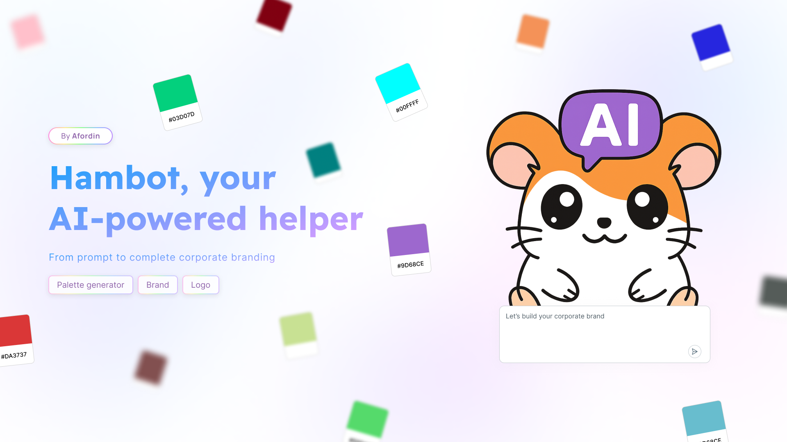
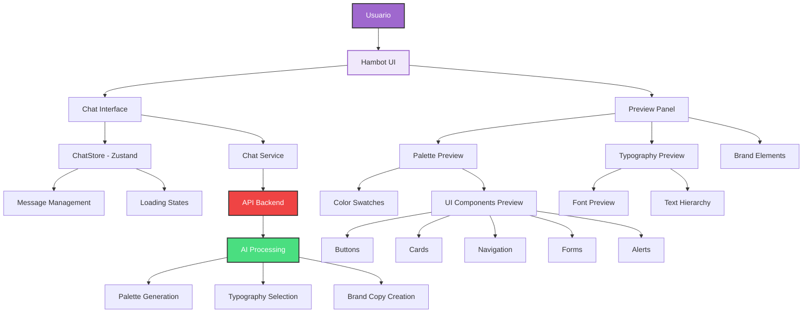

<div align="center">

# 🎨 Hambot - AI-Powered Brand Generator

   

**Hambot** es tu asistente de IA personalizado para generar branding corporativo completo. Desde paletas de colores hasta tipografías y elementos de marca, todo en una sola plataforma.

[Demo en Vivo](https://hambot.bernabe.dev) · [Frontend](https://github.com/afordigital/brand-generator) · [Backend](https://github.com/bernabedev/afor-branding-backend) · [Reportar Bug](https://github.com/afordigital/brand-generator/issues)

</div>

## 📸 Vista Previa



## 🤖 Acerca de Hambot

Hambot es un generador de marca impulsado por IA que transforma simples descripciones en identidades visuales completas. Perfecto para emprendedores, freelancers y creativos que buscan establecer una presencia de marca profesional.

### ✨ Características Principales

- **🎨 Generación de Paletas**: Crea paletas de colores profesionales basadas en la descripción de tu marca
- **📝 Selección de Tipografías**: Obtén las mejores combinaciones tipográficas para tu branding
- **💬 Chat Inteligente**: Interfaz conversacional intuitiva para generar elementos de marca
- **🔄 Vista Previa en Tiempo Real**: Visualiza instantáneamente cómo se ven tus colores en componentes UI reales
- **📋 Exportación Sencilla**: Copia paletas en formato Tailwind CSS o valores hexadecimales
- **💾 Gestión de Paletas**: Guarda y organiza tus paletas favoritas
- **🔐 Autenticación**: Sistema completo de login y registro de usuarios

## 💻 Uso

1. **Inicia una conversación**: Haz clic en el chat y describe tu marca
2. **Genera paletas**: Escribe algo como "Crea una paleta para mi café orgánico"
3. **Explora tipografías**: Solicita recomendaciones tipográficas para tu proyecto
4. **Previsualiza en tiempo real**: Ve cómo lucen tus colores en componentes reales
5. **Exporta y guarda**: Copia los códigos de color o guarda tus paletas favoritas

## 📊 Arquitectura del Sistema



## 📚 Tabla de Contenidos

- [🎨 Hambot - AI-Powered Brand Generator](#-hambot---ai-powered-brand-generator)
  - [📸 Vista Previa](#-vista-previa)
  - [🤖 Acerca de Hambot](#-acerca-de-hambot)
    - [✨ Características Principales](#-características-principales)
  - [💻 Uso](#-uso)
  - [📊 Arquitectura del Sistema](#-arquitectura-del-sistema)
  - [📚 Tabla de Contenidos](#-tabla-de-contenidos)
  - [🚀 Comenzar](#-comenzar)
    - [📋 Prerrequisitos](#-prerrequisitos)
    - [⚡ Instalación Rápida](#-instalación-rápida)
    - [📦 Construir para Producción](#-construir-para-producción)
    - [🔍 Vista Previa de Producción](#-vista-previa-de-producción)
  - [🤝 Contribuir](#-contribuir)
  - [👥 Autores](#-autores)
  - [🛠️ Stack Tecnológico](#️-stack-tecnológico)

## 🚀 Comenzar

### 📋 Prerrequisitos

Asegúrate de tener instalado:
- **Node.js** (versión 18 o superior)
- **npm**, **yarn** o **pnpm**

### ⚡ Instalación Rápida

1. **Clona o haz fork del repositorio**

   ```bash
   git clone https://github.com/afordigital/brand-generator.git
   cd brand-generator
   ```

2. **Instala las dependencias**

   ```bash
   # Con pnpm
   pnpm install
   ```

3. **Ejecuta el proyecto**

   ```bash
   # Con pnpm
   pnpm dev
   ```

4. **Abre tu navegador y visita**

   [http://localhost:5173 🎨](http://localhost:5173)

### 📦 Construir para Producción

Para crear una compilación lista para producción:

```bash
# Con pnpm
pnpm build
```

### 🔍 Vista Previa de Producción

Para previsualizar la compilación de producción localmente:

```bash
# Con pnpm
 pnpm preview
 ```

## 🤝 Contribuir

Si quieres contribuir a este proyecto, puedes hacerlo leyendo nuestra [Guía de Contribución](./CONTRIBUTING.md).

---

## 👥 Autores

<a href="https://github.com/afordigital">
   
</a>

**¡Gracias a todos los colaboradores que han hecho posible este proyecto!**

[](https://github.com/afordigital/brand-generator/graphs/contributors)

## 🛠️ Stack Tecnológico

    

### 🔧 Tecnologías Principales

- **Frontend Framework**: React 19.1.0 con TypeScript
- **Build Tool**: Vite 6.3.5 para desarrollo y construcción rápida
- **Styling**: TailwindCSS 4.1.7 con tipografía personalizada
- **Estado**: Zustand para manejo de estado global
- **Routing**: Wouter para enrutamiento ligero
- **UI Components**: Radix UI para componentes accesibles
- **Iconos**: Lucide React para iconografía moderna
- **Notificaciones**: Sonner para toast notifications
- **Manipulación de Color**: Colord para operaciones avanzadas con colores

### 📚 Librerías Adicionales

- **React Markdown**: Para renderizado de contenido markdown
- **React Dropdown Menu**: Componentes de menú desplegable
- **UUID**: Generación de identificadores únicos
- **CLSX & Tailwind Merge**: Utilidades para clases CSS condicionales

---

Hecho con ❤️ por [comuafor 🐀](https://discord.com/invite/comuafor)
